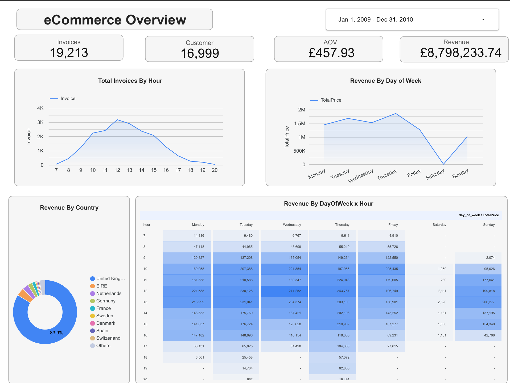
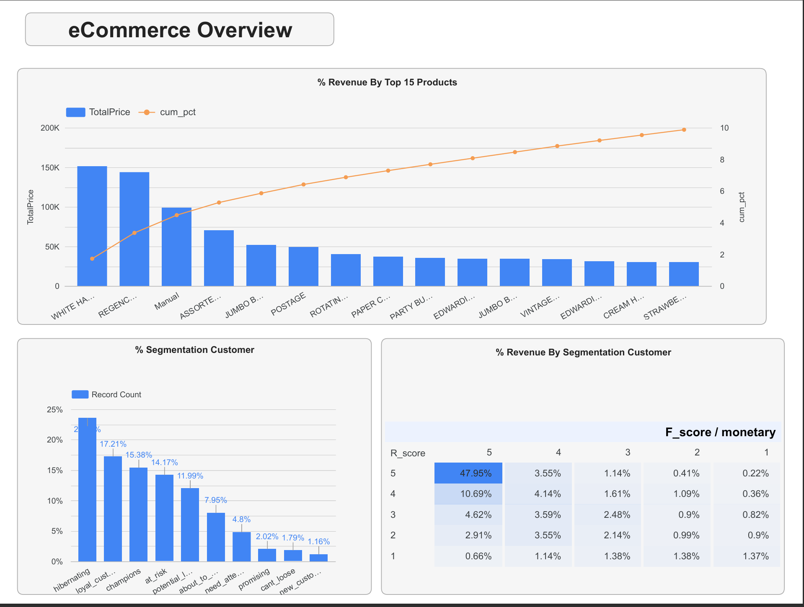

# DWH System for Online Retail  

## Mô tả
Xây dựng hệ thống DWH lưu trữ dữ liệu Online Retail để phục vụ cho nhu cầu phân tích của các 
bộ phận riêng biệt (Sales, Marketing,…) (Hiện tại, chưa có DataMart)
## Data Architecture
Sử dụng sơ đồ Star Schema

## System Architecture
- ETL: Python
- DWH: PostgreSQL
- Dashboard: Looker studio
## Cài đặt
```bash
pip install -r requirements.txt
python main.py
```
## EDA
```notebook/analysis_online_retail_dataset.ipynb```
## eCommmerce Analysis

